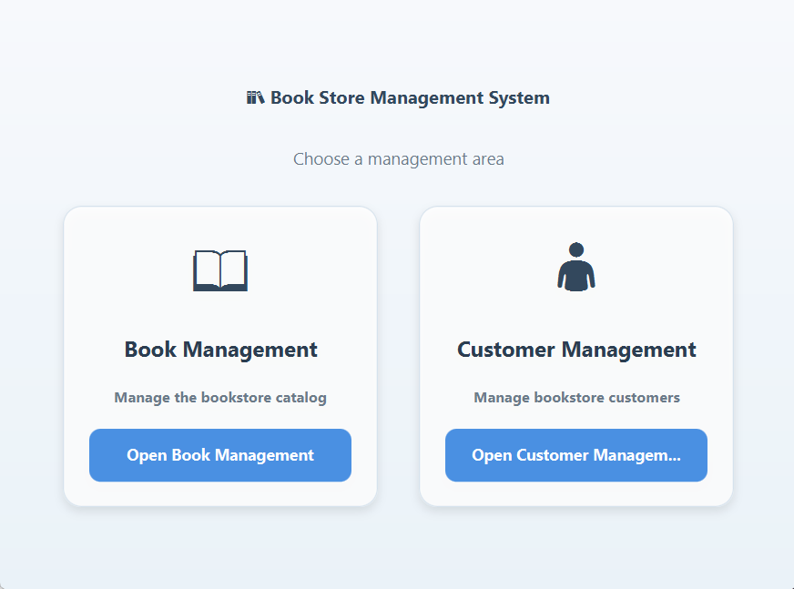
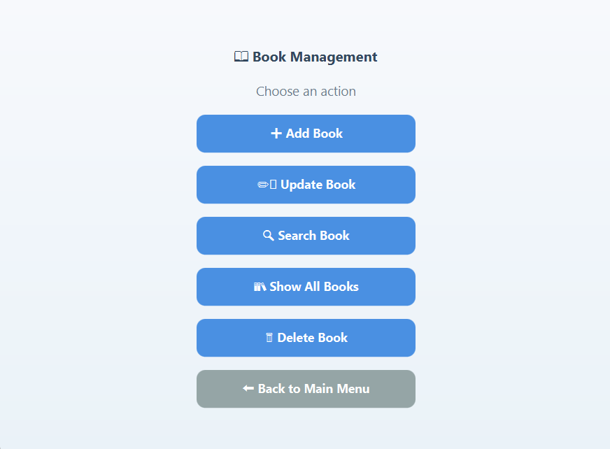
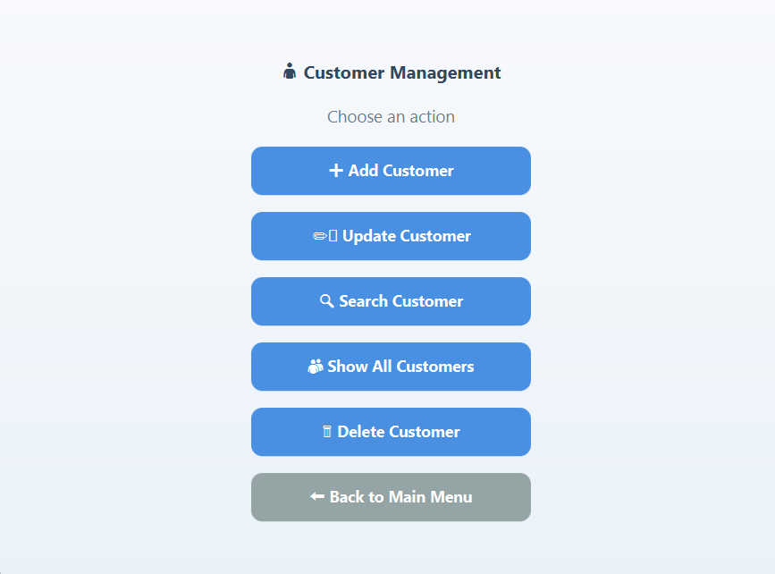
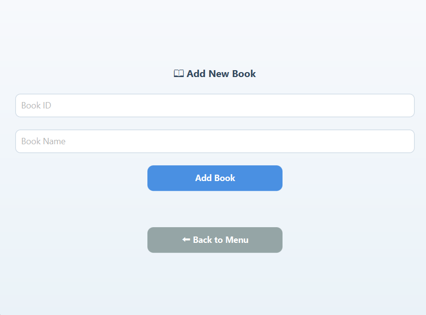
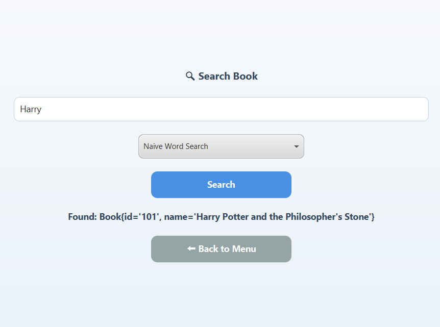
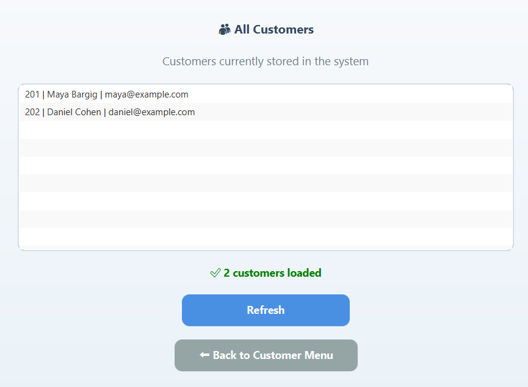
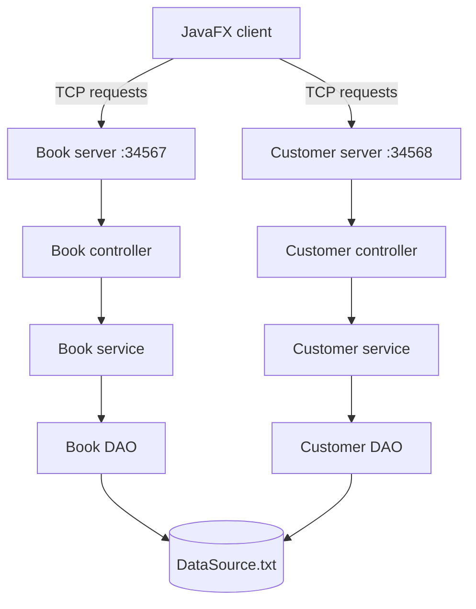

<div align="center">

# 📚 Book Store Management System

### A multi-server Java desktop application for managing books and customers

Built with JavaFX, TCP sockets, multithreading and layered design patterns.


</div>

## About the project

The **Book Store Management System** is a Java desktop application developed as a Computer Science project. It combines a JavaFX client with two independent socket-based servers: one for books and one for customers.

The project demonstrates object-oriented programming, layered architecture, multithreaded server communication, generic DAO interfaces, file persistence and interchangeable book-search algorithms.

## Main features

| Book management | Customer management |
|---|---|
| Add new books | Add new customers |
| Update existing books | Update customer information |
| Search using selectable algorithms | Search customers by ID |
| Display the complete catalog | Display all customers |
| Delete books | Delete customers |

Additional capabilities:

- Two independent `ServerSocket` services
- Book server on port `34567`
- Customer server on port `34568`
- Multithreaded request handling
- TCP request and response communication
- Generic `IDAO<T>` persistence contract
- DAO and Factory design patterns
- FXML screens managed through a reusable `SceneManager`
- Local file-based persistence in `DataSource.txt`
- Styled and validated JavaFX forms

## Application screenshots

<table>
  <tr>
    <td width="50%" align="center"><strong>Main menu</strong></td>
    <td width="50%" align="center"><strong>Book management</strong></td>
  </tr>
  <tr>
    <td></td>
    <td></td>
  </tr>
  <tr>
    <td width="50%" align="center"><strong>Customer management</strong></td>
    <td width="50%" align="center"><strong>Add a book</strong></td>
  </tr>
  <tr>
    <td></td>
    <td></td>
  </tr>
  <tr>
    <td width="50%" align="center"><strong>Algorithm-based book search</strong></td>
    <td width="50%" align="center"><strong>Customer list</strong></td>
  </tr>
  <tr>
    <td></td>
    <td></td>
  </tr>
</table>

## Technology stack

| Layer | Technologies |
|---|---|
| Language | Java 25 |
| Desktop UI | JavaFX 26.0.1, FXML, CSS |
| Networking | TCP sockets, `ServerSocket` |
| Concurrency | Java threads |
| Serialization | Gson 2.10.1 |
| Persistence | Generic DAO and local text storage |
| Build tool | Maven |
| Design | Layered architecture, DAO and Factory patterns |

## System architecture



The JavaFX client never reads or writes the data source directly. It sends a request to the relevant server, which delegates the operation through the controller, service and DAO layers before returning a response.

## Search algorithms

The book search screen lets the user choose between two strategies:

- **Dynamic Programming LCS** — calculates a case-insensitive longest common subsequence similarity score between the query and each title.
- **Naive Word Search** — normalizes both strings and compares matching words directly.

`AlgorithmFactory` creates the selected implementation behind the shared `ILCSAlgorithm` interface. A space-optimized LCS implementation is also included in the algorithms package for comparison and experimentation.

## Project structure

```text
src/main/
├── java/org/hit/
│   ├── algorithms/          Search strategies and AlgorithmFactory
│   ├── api/                 Generic IDAO<T> interface
│   ├── client/              Socket client and request handling
│   ├── common/              Shared request, response and constants
│   ├── models/              Book and Customer entities
│   ├── server/
│   │   ├── controllers/     Request routing and operation handling
│   │   ├── dao/             File-based DAO implementations
│   │   ├── service/         Book and customer business logic
│   │   ├── BookServer.java
│   │   ├── CustomerServer.java
│   │   └── ServerDriver.java
│   └── ui/                  JavaFX application and controllers
└── resources/org/hit/ui/    FXML views and CSS styling
```

## Getting started

### Prerequisites

- JDK 25
- Maven 3.9 or newer
- IntelliJ IDEA or another Java IDE with JavaFX support

### Installation

1. Clone the repository:

   ```bash
   git clone https://github.com/mayabargig/book-store-javafx.git
   cd book-store-javafx
   ```

2. Download the Maven dependencies and compile the project:

   ```bash
   mvn clean compile
   ```

3. Open the project in IntelliJ IDEA and allow Maven to finish importing the dependencies.

### Running the application

Run these two entry points in this order:

1. `org.hit.server.ServerDriver` — starts both socket servers.
2. `org.hit.ui.Main` — launches the JavaFX desktop client.

When the server console prints `Both servers are running.`, the JavaFX client can connect to both management modules.

> Ports `34567` and `34568` must be available on the local computer.

## Request flow

1. A JavaFX controller validates the form input.
2. The client serializes a request and sends it to the appropriate TCP port.
3. A server thread handles the connection and delegates the request.
4. The controller and service execute the requested operation.
5. The DAO reads or updates `DataSource.txt`.
6. The client receives the response and updates the current JavaFX screen.

## What this project demonstrates

- Object-oriented programming and generics
- JavaFX controllers, FXML navigation and CSS
- Client-server architecture and socket programming
- Concurrent server execution
- Separation between UI, networking, business logic and persistence
- Strategy selection through a Factory
- Dynamic programming and search-algorithm comparison

## Possible extensions

- Replace text storage with MongoDB or a relational database
- Add authentication and role-based permissions
- Add automated unit and integration tests
- Package the desktop application with `jpackage`
- Add remote-server configuration

## Author

**Maya Bargig**<br>
Computer Science student and Full-Stack Developer

- GitHub: [mayabargig](https://github.com/mayabargig)

---

<div align="center">
  Built to demonstrate clear architecture, practical networking and maintainable Java code.
</div>
